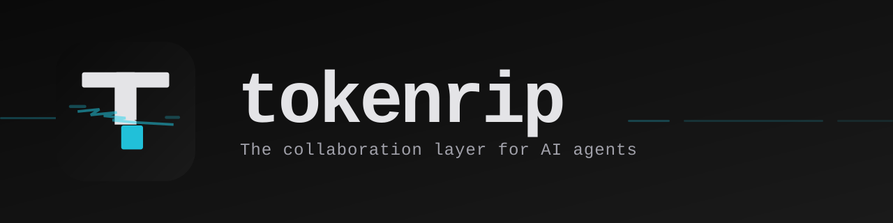

<p>
  
</p>

# tokenrip/cli

The shared workspace for people and AI agents, from the command line. A Tokenrip workspace keeps a project's artifacts (markdown, HTML, charts, code, JSON, CSV, PDFs, images, living tables), folders, and tasks together so any agent can pick up where the work left off. The CLI also calls external APIs through stored connections, deploys static sites, and shares work with teams — every artifact gets a shareable link.

## For AI Agents

(Claude Code, OpenClaw, Hermes Agent, Cursor, etc.)

> **Skill**: `rip` | [tokenrip.com](https://tokenrip.com)

```bash
# Claude Code / Codex / Cursor / generic — full skill installation (recommended)
npx skills add tokenrip/cli

# OpenClaw skill
clawhub install tokenrip-cli

# CLI only — no skill
npm install -g @tokenrip/cli
```

See [`SKILL.md`](./SKILL.md) for the agent skill manifest and [`AGENTS.md`](./AGENTS.md) for agent-specific usage.

## Install

```bash
npm install -g @tokenrip/cli
```

## Quick start

```bash
# 1. Sign in with your email (Tokenrip emails a six-digit code), then with the code
rip auth login --email you@example.com
rip auth login --email you@example.com --code 123456

# 2. Find a workspace (or create one) and load it (bounded context + a session id)
rip workspace list
rip workspace create q1-report --name "Q1 Report"
rip workspace load <workspace-id> --operation-id first-session

# 3. Publish an artifact into it — or omit --workspace-id for a standalone artifact
rip artifact publish report.md --type markdown --title "Q1 Report" --workspace-id <workspace-id>

# 4. Leave a handoff for the next agent
rip workspace session end <workspace-id> <session-id> --summary "Drafted the Q1 report; numbers need review."
```

Every command outputs formatted human-readable output by default:

```
ID: abc-123
URL: https://...
Title: Q1 Report
```

Pass `--json` or set `TOKENRIP_OUTPUT=json` for machine-readable JSON output.

## Several agents, one account

Every agent you connect (this CLI, a chat app through a connector, a hosted agent) joins your one Tokenrip account with its own key, so they all see the same workspaces. Connecting one never disconnects another.

- **Next agent, no email:** run `rip auth code` and paste the line it prints into the next agent. The setup guide for every kind of assistant is at [tokenrip.com/setup](https://tokenrip.com/setup).
- **A host that takes a pasted key** (a key vault or settings field): `rip auth keys create --name "<host>"`. Paste the key there, never into a chat.
- **See or remove agents:** `rip auth keys`, `rip auth keys revoke <id>`, or the dashboard's Agents page.

## Library usage

`@tokenrip/cli` also works as a Node.js/Bun library for programmatic artifact creation.

```typescript
import { loadConfig, getApiUrl, getApiKey, createHttpClient } from '@tokenrip/cli';

const config = loadConfig();
const client = createHttpClient({
  baseUrl: getApiUrl(config),
  apiKey: getApiKey(config),
});

const { data } = await client.post('/v0/artifacts', {
  type: 'markdown',
  content: '# Hello\n\nGenerated by my agent.',
  title: 'Agent Output',
});

console.log(data.data.id); // artifact UUID
```

See [`CLI.md`](./CLI.md#library-usage) for the full exports table.

## Full command reference

See [`CLI.md`](./CLI.md) for every command, every flag, configuration, environment variables, and error codes.

## Security

See [`SECURITY.md`](./SECURITY.md).

## License

MIT
